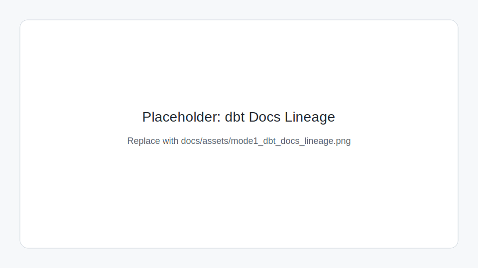
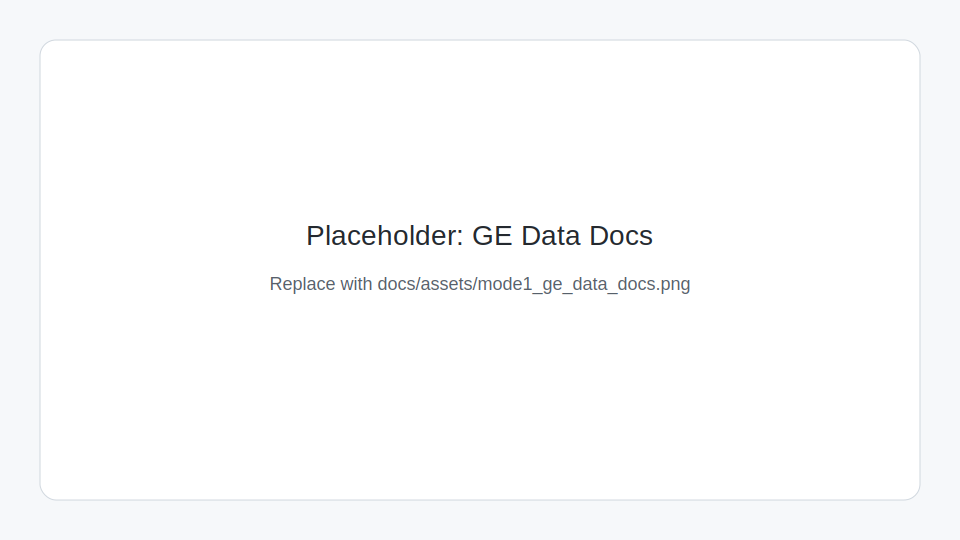
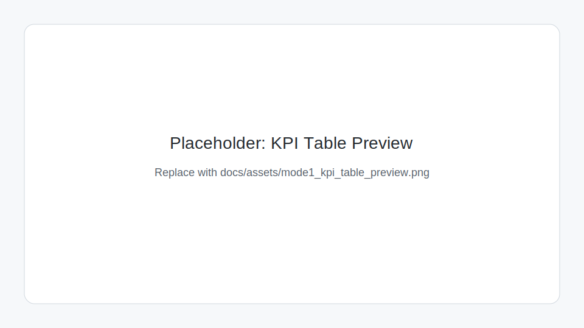
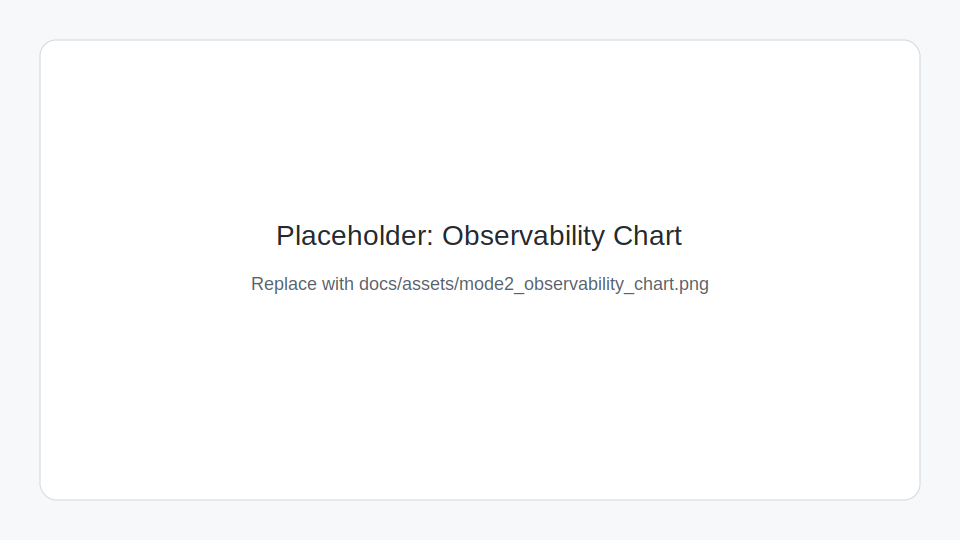

# Enterprise Industrial Data Platform


Portfolio-grade Two-Mode data platform: local notebook-first Lakehouse by default, enterprise infra optional.

## Two Execution Modes

### Mode 1 (Default): Local Lakehouse
Mode 1 is the primary path for development, interviews, and CI.

```bash
make setup
make run-all
make dbt-run
make dbt-test
make dq
make dbt-preview
```

What this proves:
- End-to-end local Medallion flow (Bronze -> Silver -> Gold) with DuckDB + Parquet
- dbt model/test discipline (`make dbt-test`)
- Great Expectations quality gate (`make dq`)
- Queryable KPI outputs (`make dbt-preview`)

Expected runtime outputs:
- `lakehouse/bronze/*`, `lakehouse/silver/*`, `lakehouse/gold/*`
- `lakehouse/warehouse/lakehouse.duckdb`
- `reports/great_expectations/`
- `reports/metrics/pipeline_metrics.json`

### Mode 2 (Optional): Enterprise Infra
Mode 2 is intentionally optional and **not required** to validate Mode 1 or pass CI.

```bash
make infra-up
make infra-status
make infra-logs
make infra-smoke
make infra-down
```

Primary URLs:
- Airflow: `http://localhost:8089` (`admin` / `admin`)
- Grafana: `http://localhost:3000` (`admin` / `admin`)
- Prometheus: `http://localhost:9090`
- Kafka UI: `http://localhost:8088`
- MinIO Console: `http://localhost:9001` (`minioadmin` / `minioadmin`)
- Spark Master UI: `http://localhost:18080`
- Spark Worker UI: `http://localhost:18081`

Smoke demo:
1. Start services with `make infra-up`.
2. Open Airflow and trigger DAG `infra_smoke_dag`.
3. Confirm artifact exists at `reports/infra_smoke/ok.txt`.
4. Optional CLI verification: `make infra-smoke`.
5. Stop services with `make infra-down`.

## Recruiter Quick Proof
Run these 4 commands and you will see validated KPIs:

```bash
make setup
make run-all
make dbt-test
make dq
```

Then inspect KPI outputs:

```bash
make dbt-preview
```

## Visual Demo (Screenshots)
Place screenshots in `docs/assets/` using these file names:
- `mode1_dbt_docs_lineage.png`
- `mode1_ge_data_docs.png`
- `mode1_kpi_table_preview.png`
- `mode2_observability_chart.png`

Placeholder assets are tracked so markdown links always resolve:
- 
- 
- 
- 

## Architecture

### Mode 1 (Default)
```text
FiveThirtyEight CSV (HTTPS)
        |
        v
data/raw -> bronze parquet -> silver parquet -> dbt (DuckDB) -> gold marts/KPIs
                                                          |
                                                          v
                                       dbt tests + Great Expectations + reports
```

### Mode 2 (Optional)
```text
Kafka <-> Spark <-> MinIO
   |          |        |
   +----------+--------+--> Airflow (8089) --> reports/infra_smoke/ok.txt

Prometheus (9090) <- cAdvisor (8082) -> Grafana (3000)
```

## Repo Organization

Root contains Mode 1 core and docs:
- `notebooks/`, `src/`, `scripts/`, `dbt/`, `great_expectations/`
- `data/`, `lakehouse/`, `reports/`
- `docs/`, `tests/`, `Makefile`, `.github/workflows/ci.yml`

Enterprise-only assets are isolated under:
- `modes/mode2_enterprise/`

## Optional: Publish Gold to MySQL

```bash
make mysql-up
make mysql-publish
make mysql-preview
make mysql-down
```

## Tradeoffs and ADRs
- DuckDB + dbt for local Lakehouse speed and reproducibility: `docs/adr/0001_duckdb_dbt_choice.md`
- Two-Mode structure to separate fast local validation from enterprise demos: `docs/adr/0002_two_mode_repo.md`
- Optional MySQL serving layer for downstream BI/API consumption: `docs/adr/0003_mysql_serving_layer.md`
- Formatting and CI policy (fast Mode 1 CI with lightweight lint/format): `docs/adr/0004_formatting_and_ci_policy.md`

## CI and Data Policy
- CI runs Mode 1 only (`make setup`, `make run-all`, `make dbt-test`, `make dq`).
- Docker Compose is intentionally excluded from CI.
- Runtime outputs in `lakehouse/` and `reports/` are not committed.
- Raw datasets are downloaded at runtime and kept out of version control.
