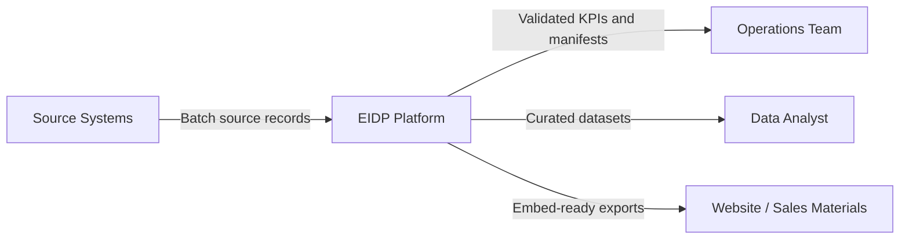
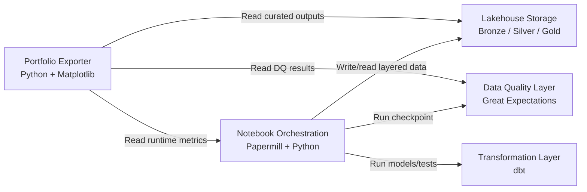
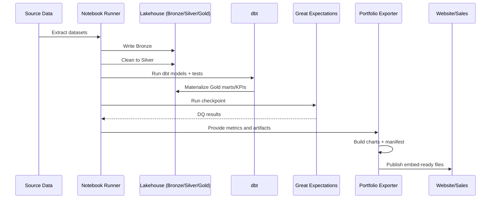

# Technical Overview

## Architecture (Context + Containers)

## Data Flow (Sequence)

## Layered Model (Medallion)

- Bronze:
  - Raw-ish ingested records with metadata (`_ingested_at`, `_source`, `_dataset`, `_batch_id`, `_row_hash`).
  - Purpose: reproducible landing zone and lineage traceability.
- Silver:
  - Type-cleaned, deduplicated, standardized records.
  - Purpose: trusted analytical base with consistent schemas.
- Gold:
  - Business-facing marts and KPI tables.
  - Purpose: direct consumption by reporting, dashboards, and portfolio exports.

## Data Quality Strategy

- Rule engine: Great Expectations checkpoint on silver datasets.
- Rule types: not-null, accepted values, row-count bounds, and type checks.
- Threshold behavior:
  - Violations are counted and surfaced in `run.json`.
  - Pipeline can fail fast when checkpoint status is unsuccessful.
- Quarantine approach:
  - In this repo, violations are reported through validation results.
  - In production, failing records should be routed to quarantine tables/paths for triage and replay.

## Idempotency and Reproducibility

- Deterministic transformations:
  - Stable row hashing and sorted outputs during ingestion/cleaning.
  - Deterministic daily bucketing logic for throughput charting from year-level records.
- Re-runnable exports:
  - `make portfolio-export RUN_ID=<id>` creates isolated run folders.
  - `latest.txt` points to the newest run without mutating prior runs.
- Traceability:
  - `manifests/run.json` captures `run_id`, timestamps, git SHA, sources, row counts, DQ summary, and exported file sizes.

## Observability

- Runtime metrics:
  - Stage runtimes are tracked in `reports/metrics/pipeline_metrics.json`.
- Quality metrics:
  - Evaluated rules, violations count, and category-level breakdown.
- Export checks:
  - Image size guardrails (`<= 500KB`) enforced during generation.
- Operational artifacts:
  - Executed notebooks and DQ reports are persisted in `reports/`.

## Security and PII Handling Guidance

- Current portfolio datasets are public and non-sensitive.
- For enterprise deployment:
  - Classify columns by sensitivity (PII/confidential/public).
  - Mask or tokenize PII before silver/gold publication.
  - Restrict access by role (least privilege).
  - Avoid exposing private source URLs or secrets in manifests and public artifacts.
  - Add encryption at rest/in transit and secrets management for connectors.
